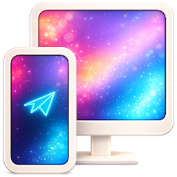
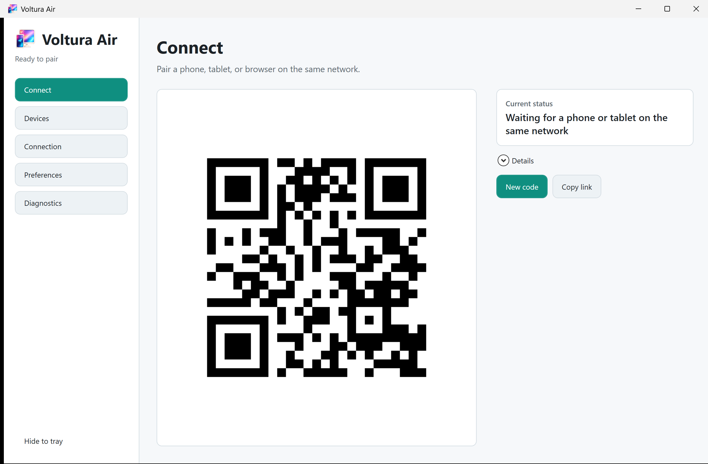
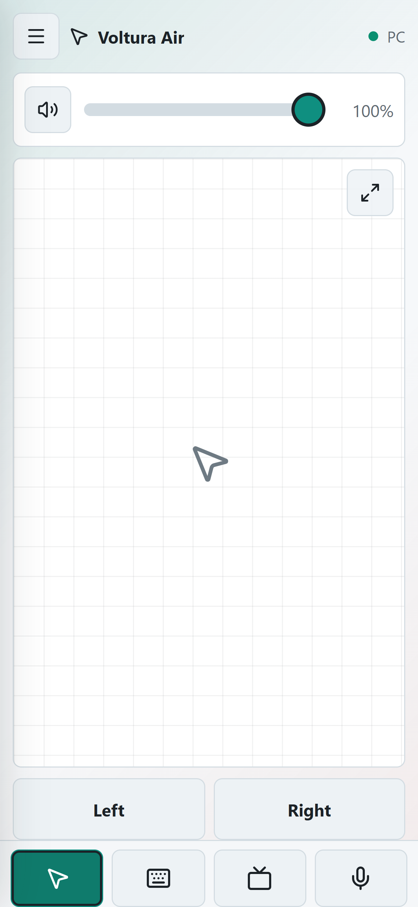
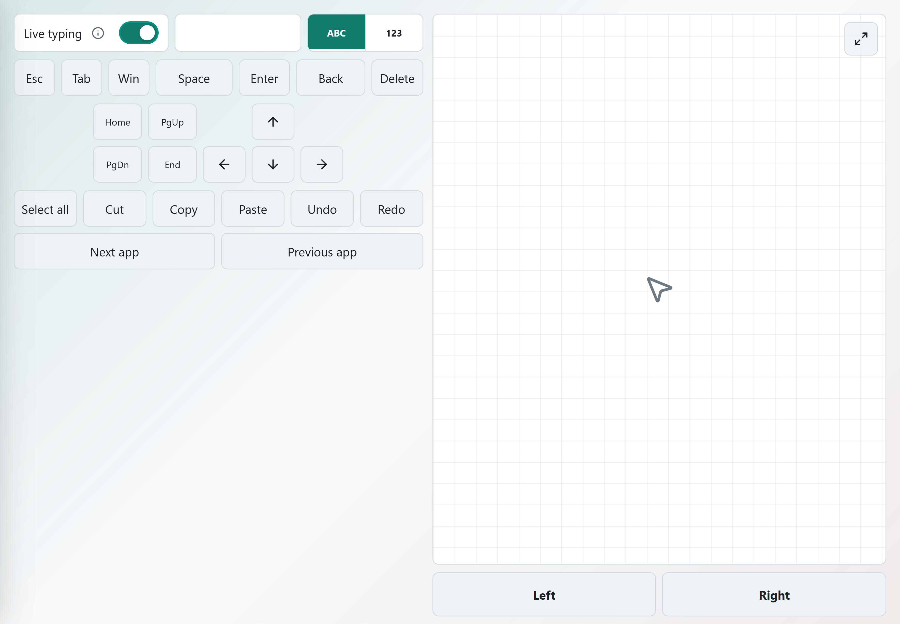

# Voltura Air

<p align="center">
  
</p>

Turn a phone, tablet, or touch browser into a wireless remote for a Windows PC.

Voltura Air provides a trackpad, keyboard, text tools, dictation, media controls,
and practical PC actions over the local network. There is no mobile app-store
install, account, subscription, or cloud relay.

## Core uses

- Move, click, scroll, and type from a phone or tablet.
- Dictate on supported browsers or send longer text composed on the mobile device.
- Control media, volume, YouTube, Kodi, and common browser or window actions.
- Use a landscape tablet as a combined keyboard and trackpad.

See the [complete implemented feature list](docs/features.md).

## Screenshots

<p align="center">
  <picture>
    <source media="(prefers-color-scheme: dark)" srcset="docs/site/assets/voltura-air-host-dark.png">
    
  </picture>
  <br>
  <sub>Windows host pairing screen</sub>
</p>

<table>
  <tr>
    <td align="center" width="34%">
      <picture>
        <source media="(prefers-color-scheme: dark)" srcset="docs/site/assets/voltura-air-iphone-dark.png">
        
      </picture>
      <br>
      <sub>Phone trackpad</sub>
    </td>
    <td align="center" width="66%">
      
      <br>
      <sub>Landscape split keyboard and trackpad</sub>
    </td>
  </tr>
</table>

## How it works

Install the Windows host on the PC, open Voltura Air from the tray, and scan its
QR code from a browser-capable device on the same Wi-Fi or LAN. The host serves
the mobile web app and stores pairing, permissions, and host configuration on
the PC. A paired browser can reconnect while its saved credential remains valid.

Voltura Air is intended for trusted devices on a local network. It is not a
remote-desktop service, public-internet relay, file-sync product, or remote wake
solution for a sleeping or shut-down PC.

## Install

Voltura Air requires Windows 11 on the host PC. Choose one download from the
[latest GitHub release](https://github.com/voltura/voltura-air/releases/latest):

- `VolturaAir-Setup-<version>-win-x64.exe` downloads required .NET 10 Desktop
  and ASP.NET Core runtimes when they are missing. That runtime installation may
  require internet access and administrator approval.
- `VolturaAir-Setup-<version>-win-x64-full.exe` includes the required runtimes
  and installs per user without a runtime download.
- `VolturaAir-<version>-win-x64.zip` is the portable package.

Both installers keep pairing and settings data when the app is uninstalled.
See [docs/setup.md](docs/setup.md) for installation, development startup, command
line options, and first-connection guidance.

## Trust, security, and distribution

Voltura Air is freeware from Voltura AB and is open source under the
[MIT License](LICENSE). It can be used without payment, registration, trial
limits, or feature locks.

Release binaries are currently not code-signed. Windows can therefore show an
unknown-publisher or Microsoft Defender SmartScreen warning. Download only from
the [official product page](https://voltura.se/air/) or the
[official GitHub releases](https://github.com/voltura/voltura-air/releases/latest).

[Security policy](SECURITY.md)

Do not publish vulnerability details or pairing credentials in a public issue.

Optional support links:

- [Ko-fi](https://ko-fi.com/voltura)
- [PayPal](https://www.paypal.me/voltura)

## Development and contributing

Development requires Node.js/npm, the .NET 10 SDK, and Visual Studio Build Tools
with the Desktop development with C++ workload.

```powershell
npm ci
npm run build
npm test
```

Use `npm install` instead when intentionally changing dependency manifests.
Start the normal development loop with `npm run dev`.

- [Documentation map](docs/README.md)
- [Setup and development](docs/setup.md)
- [Architecture](docs/architecture.md)
- [UI system](docs/ui-system.md)
- [Protocol](docs/protocol.md)
- [Contributing](CONTRIBUTING.md)
- [Code of conduct](CODE_OF_CONDUCT.md)
- [Project TODO](docs/todo.md)

## Statistics

[](https://hits.sh/github.com/voltura/voltura-air/)
[](https://github.com/voltura/voltura-air)
[](https://github.com/voltura/voltura-air/stargazers)
[](https://github.com/voltura/voltura-air/forks)
[](https://github.com/voltura/voltura-air/commits)
[](https://github.com/voltura/voltura-air)
[](https://github.com/voltura/voltura-air)
