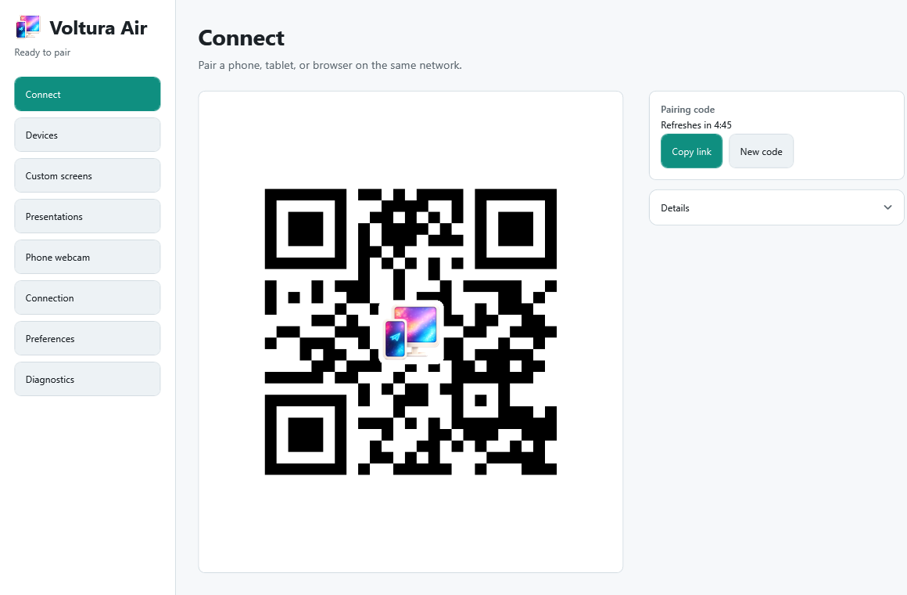
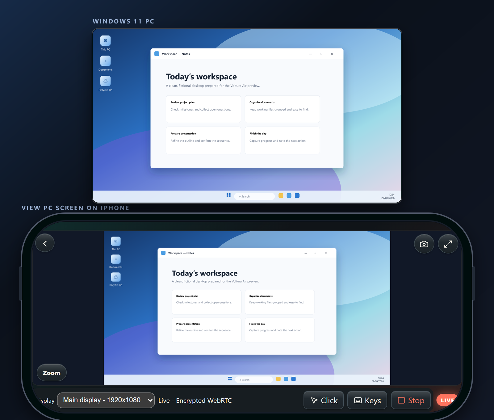
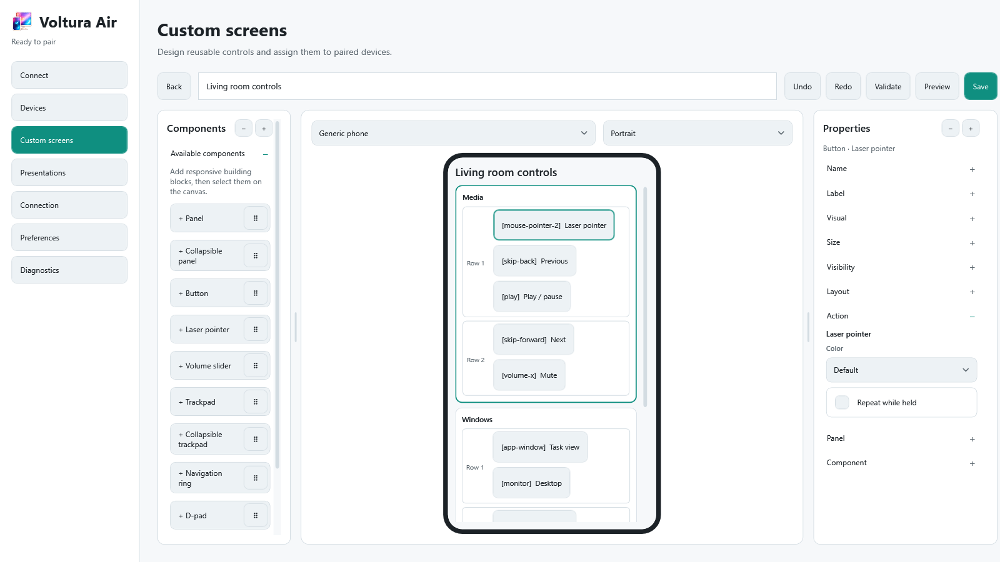
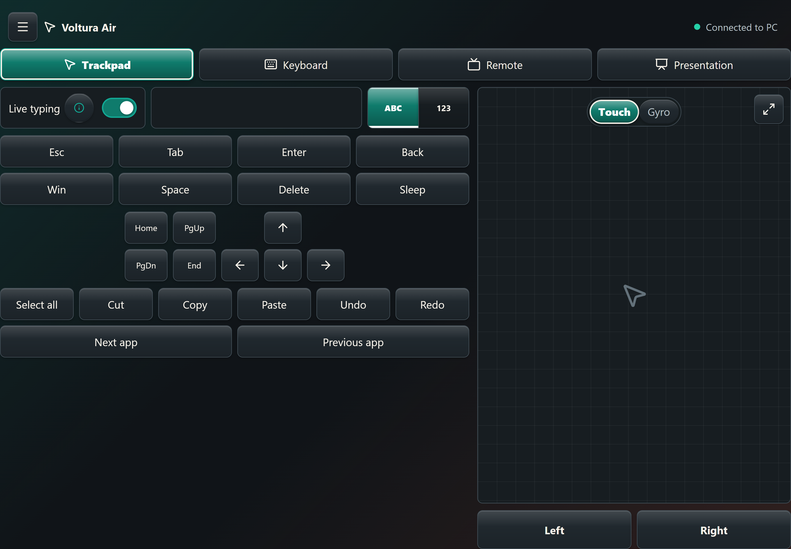
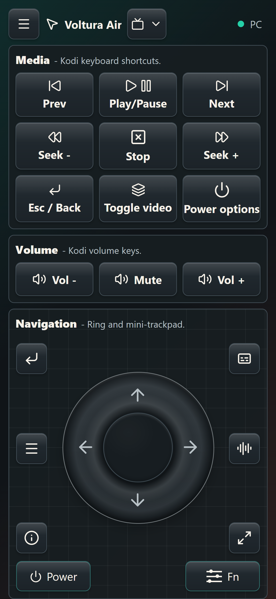
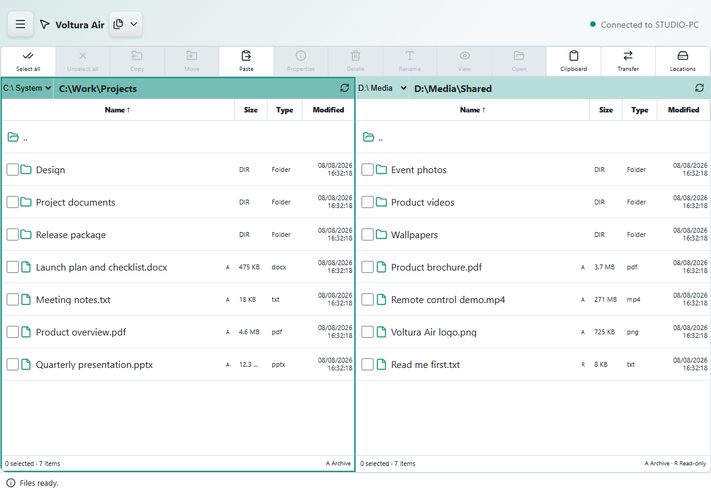

# Voltura Air

<p align="center">
  
</p>

Turn a phone, tablet, or browser into a wireless remote&mdash;and live screen
viewer or Windows webcam with optional phone audio&mdash;for a Windows 11 PC. With a mouse or trackpad and physical keyboard,
**View PC screen** also lets you work on that PC from another computer. No
app-store install or Voltura account is required. Direct LAN remains the default;
on Direct LAN, enhanced device features can add sensor-powered controls while
established traffic stays local. An optional Cloud relay is available for
networks that block inbound PC connections.

## What you can do

- Use a phone or tablet as a wireless touch trackpad and keyboard—or point the
  device itself to steer the mouse with Gyro. Enhanced device features over HTTPS
  unlock Gyro on supported phones and tablets.
- View one selected Windows display live on a paired phone, tablet, or browser
  over Direct LAN or the optional Cloud relay, with encrypted video, responsive
  cursor movement, scrolling, and up to 10× local zoom. Direct viewing adapts up
  to the display, hardware, receiving device, and network capabilities; Relay
  offers High, Standard, and Data saver quality choices under the existing usage
  protections. A camera action captures the watched display as a native,
  cursor-free PNG and opens the device's existing Save/Share flow.
- Use a selected paired-phone camera as `Voltura Air Webcam` in Windows apps.
  Enhanced Direct is free and unlimited; Relay initially shares the existing
  service usage limits. Optional microphone audio is off by default, can be muted
  from the phone, and leaves camera switching and recovery on the existing video track.
- From another computer, use **View PC screen** with a mouse or trackpad and
  physical keyboard to move, left- or right-click, drag, scroll, and type on
  the selected Windows display.
- Switch between open PC windows with **Apps**. Flick through a circular card
  deck, restore or focus the centered window, close it normally, or open an
  application defined on the PC. Static previews are available when permitted.
- Browse and manage files on the PC or its mapped drives. **Files** adapts from
  one touch panel in narrow views to two panels whenever the screen is wide
  enough, including phones in landscape, with direct copy/move, Windows
  clipboard operations, properties, background progress, and an option to open
  a file and continue into the PC screen mirror. Its compact Transfer menu can
  save one selected PC file to the device or upload one chosen device file into
  the active PC folder.
- Ask the **AI Assistant** from the Windows host or a personal paired device how
  Voltura Air works, troubleshoot a feature, or investigate information
  available to your Windows account. The host entry stays visible when Codex is
  unavailable; the paired-device tool appears when it is ready. Questions are
  typed on the host and can also be dictated on supported mobile browsers.
- Open an interactive Windows PowerShell session with **Terminal** over Direct
  LAN or Cloud relay, with touch shortcuts, selectable output, copy, scrolling,
  and authenticated reconnect. PowerShell runs with the signed-in Windows
  user's normal access.
- Control presentations, use a laser pointer, track time, and review saved
  reports on the PC.
- Dictate, reuse snippets, and send text to a PC app, document, email draft, or
  clipboard. Supporting HTTPS browsers can paste from the current device's
  clipboard, get PC clipboard text into a visible box, or fetch fresh PC
  clipboard text directly into the current phone, tablet, or computer's
  clipboard.
- Control media, volume, browser tabs, windows, and applications selected on
  the PC.
- Design reusable Custom screens on the PC with responsive buttons, shortcuts,
  approved app actions, collapsible panels, and regular or collapsible
  trackpads, navigation rings, and D-pads; preview and assign them, export or
  import `.volturascreen` packages, or browse the
  [community library](https://voltura.se/air/screens/).
- Keep the PC awake, lock it, blank its displays, restart it, or shut it down.
- Optionally simulate activity without moving or clicking the pointer.
- Combine a keyboard and trackpad on a landscape tablet.

See the [complete implemented feature list](docs/features.md).

## Screenshots

<p align="center">
  <picture>
    <source media="(prefers-color-scheme: dark)" srcset="apps/public-site/assets/voltura-air-host-dark.png">
    
  </picture>
  <br>
  <sub>Windows host pairing screen</sub>
</p>

<p align="center">
  
  <br>
  <sub>View PC screen on iPhone</sub>
</p>

<p align="center">
  <picture>
    <source media="(prefers-color-scheme: dark)" srcset="apps/public-site/assets/voltura-air-host-custom-screens-dark.png">
    
  </picture>
  <br>
  <sub>Responsive Custom screens editor</sub>
</p>

<table>
  <tr>
    <td align="center" width="34%">
      <picture>
        <source media="(prefers-color-scheme: dark)" srcset="apps/public-site/assets/voltura-air-iphone-dark.png">
        
      </picture>
      <br>
      <sub>Phone trackpad</sub>
    </td>
    <td align="center" width="66%">
      
      <br>
      <sub>Landscape split keyboard and trackpad</sub>
    </td>
  </tr>
</table>

<p align="center">
  
  <br>
  <sub>Phone Kodi remote</sub>
</p>

<p align="center">
  <picture>
    <source media="(prefers-color-scheme: dark)" srcset="apps/public-site/assets/voltura-air-files-dark.png">
    
  </picture>
  <br>
  <sub>Two-panel Files on PC</sub>
</p>

## Download and install

Voltura Air requires Windows 11. Choose one package from the
[latest GitHub release](https://github.com/voltura/voltura-air/releases/latest):

- **Standard installer:** `VolturaAir-Setup-<version>-win-x64.exe` downloads
  missing .NET 10 Windows Desktop/ASP.NET Core runtimes and may need internet or
  administrator approval.
- **Full installer:** `VolturaAir-Setup-<version>-win-x64-full.exe` includes
  those runtimes.
- **Portable:** `VolturaAir-<version>-win-x64.zip`.

Installers are per-user under `%LOCALAPPDATA%\Programs\Voltura Air`, create
Start Menu shortcuts, and retain pairing/settings under `%APPDATA%\Voltura Air`
on uninstall. Start-at-sign-in is an in-app setting.
The optional **Phone Webcam** installer component installs the protected Windows
virtual camera only after explicit selection and UAC approval. The in-app page
reports component state. Windows **Installed apps → Voltura Air → Modify** reopens
the same installer component page so Phone Webcam can be added, repaired, or removed;
uninstall removes the component before deleting the per-user app.
Optional microphone output requires user-installed [VB-CABLE](https://vb-audio.com/Cable/).
VB-CABLE is third-party donationware, is not included or distributed with Voltura Air,
and is obtained directly from VB-Audio under the licence applicable to the user's use.
During an active microphone-enabled Phone Webcam session, the Windows page can
explicitly monitor `CABLE Output` through the default speakers for end-to-end testing.
Use headphones or keep the phone away from the speakers while testing to avoid
acoustic echo or feedback.

Installed stable builds check GitHub Releases at most once a day and automatically stage a newer release by default. Installation is always explicit from the **Update** button or tray menu; startup never installs or requests UAC. The first updater-capable version must be installed manually.

## Connect

1. Install or extract Voltura Air and start it on the PC.
2. Open **Connect**.
3. Scan the QR code from a phone or tablet on the same Wi-Fi or LAN.

For Gyro mouse and other browser features that require HTTPS, open
**Connection**, select **Enable enhanced device features**, then save and restart. The
primary QR opens Voltura Air's secure hosted controller, while established
control traffic travels directly between the device and PC over the selected
private LAN. A Standard Local link remains available on the Connect page.

For restricted company networks, open **Connection**, select **Cloud relay
through Voltura**, then save and restart. Both devices connect outward, so the
PC does not need an incoming firewall exception. The short QR opens the hosted
Voltura Air app at `voltura.se`; pairing, reconnect, permissions, and device
removal work the same way as Direct LAN. Initial Direct connections use a
3-second startup window; Relay connections allow 10 seconds so VPN and managed
network inspection can add latency without causing an early failure.

Paired devices are remembered until removed or their browser data is cleared.
New pairings receive the **My device** or **Remote controls** access profile selected
in Preferences. Existing devices retain their effective access as **Custom**, and
each device can be changed or customized from Devices. Access profiles do not
change pairing links, QR data, tokens, authentication, or protocol messages. The
disabled-by-default permission to control the Voltura Air window or tray and the
protected-file filter remain separate from profiles.
On paired devices, **AI Assistant** is available only to the **My device**
profile. Its Windows host entry is always visible. Codex must be installed and
signed in on the PC. The Assistant is read-only but can inspect information with
the same Windows-user access as local Codex, so use it only from a personal
trusted device.
The optional **View PC screen** tool requires the **View PC screen** permission
on the PC before a paired phone, tablet, or browser can use it. Direct physical
mouse and keyboard control from another computer also requires Pointer and
keyboard permission. **Files** separately requires Browse and open files
permission; file-changing actions also require Change files permission, and
one-file transfers require Transfer files permission. **Apps** requires Control
open applications; static previews additionally require View PC screen, while
applications defined on the PC retain the separate Application launch permission.
**Terminal** requires Terminal permission and a current PC identity pairing.
**Phone webcam** requires Enhanced Direct or Relay, an enabled virtual camera, and
the effective Phone webcam permission for the paired device.

## Trust, privacy, and distribution

Direct LAN is intended for trusted local networks. Standard Local needs no cloud
service. Enhanced Direct uses `voltura.se` to load the secure controller and
exchange connection setup; established control traffic stays on the private
LAN. Optional Cloud relay carries end-to-end encrypted command frames through a
routing service and uses TURN for DTLS-SRTP screen media; the relay cannot read
commands or screen pixels. Voltura Air is not file sync or a remote wake solution
for a sleeping or shut-down PC.

Voltura Air is freeware from Voltura AB and is open source under the
[MIT License](LICENSE). It can be used without payment, registration, trial
limits, or feature locks.

Optional **Usage statistics** are off until explicitly allowed. When allowed,
only the Windows host sends a random installation identifier, its version, and
coarse host-start, successful-connection, and feature-using-session counts to
Voltura-operated infrastructure. The mobile web app does not send telemetry,
and normal local or remote control does not require statistics or an account.
The choice can be changed under **Diagnostics → Usage statistics**.

Release binaries are not code-signed. Windows can therefore show an
unknown-publisher or Microsoft Defender SmartScreen warning. Download only from
the [official product page](https://voltura.se/air/) or the
[official GitHub releases](https://github.com/voltura/voltura-air/releases/latest).

[Privacy policy](PRIVACY.md) &middot; [Security policy](SECURITY.md) &middot;
[Third-party software notices](THIRD-PARTY-NOTICES.md)

Do not publish vulnerability details or pairing credentials in a public issue.

## Support

Support is optional:

- [Ko-fi](https://ko-fi.com/voltura)
- [PayPal](https://www.paypal.me/voltura)

## Develop from source

Requirements: Node.js 24.19.0 LTS, npm 11.19.0, the .NET 10.0.400 SDK,
PowerShell 7.6 LTS, PHP 8.5.9 or newer on the 8.5 line, NSIS 3.12 or newer, and Visual Studio 2026 18.9 or newer with
the **Desktop development with C++** workload. `npm run tools:check` verifies
the installed toolchain before a broad build.

```powershell
git clone https://github.com/voltura/voltura-air.git
cd voltura-air
npm ci
npm run dev
```

- [Contributing](CONTRIBUTING.md)
- [Development workflows and validation](docs/setup.md#development-workflows)
- [Cloud relay and advanced self-hosting](docs/relay-deployment.md)
- [Documentation map](docs/README.md)

## Statistics

[](https://hits.sh/github.com/voltura/voltura-air/)
[](https://github.com/voltura/voltura-air)
[](https://github.com/voltura/voltura-air/stargazers)
[](https://github.com/voltura/voltura-air/forks)
[](https://github.com/voltura/voltura-air/commits)
[](https://github.com/voltura/voltura-air)
[](https://github.com/voltura/voltura-air)
