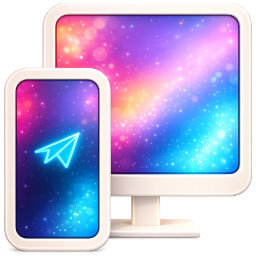
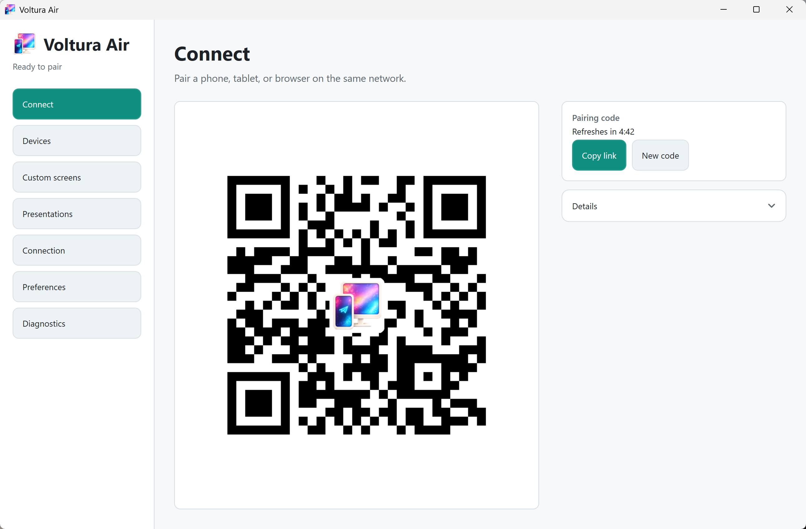
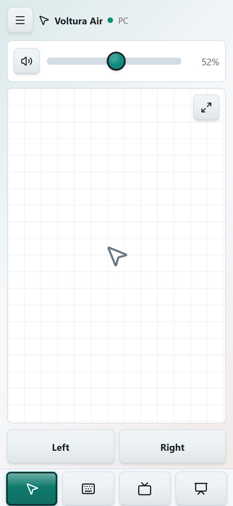
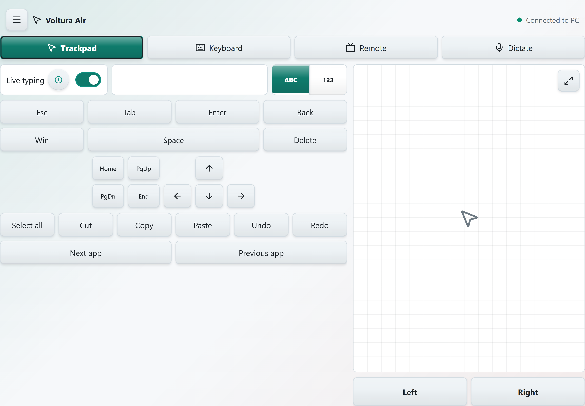
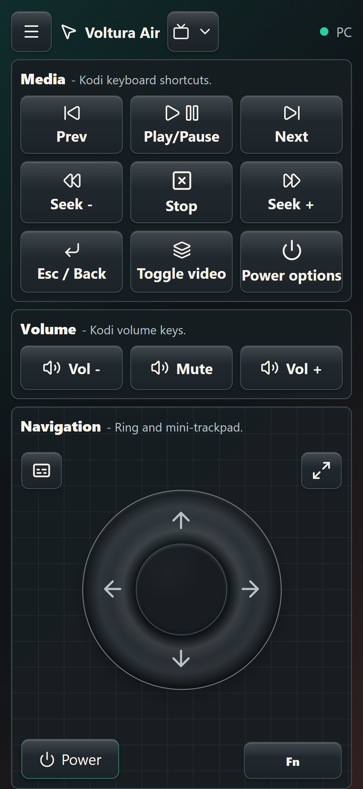
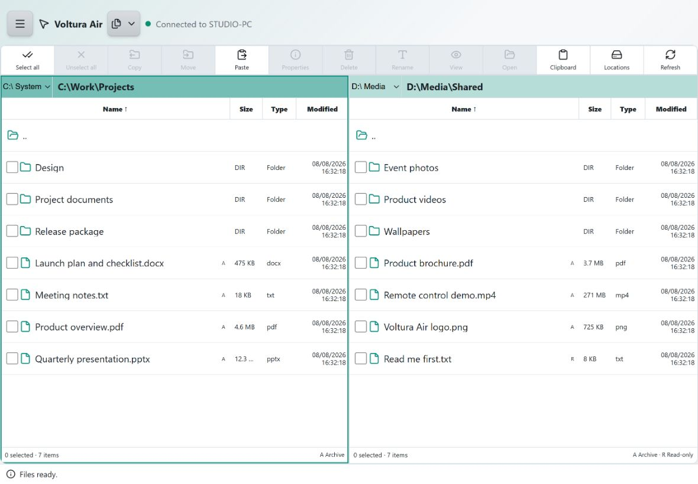

# Voltura Air

<p align="center">
  
</p>

Turn a phone, tablet, or browser into a wireless remote&mdash;and live screen
viewer&mdash;for a Windows 11 PC. With a mouse or trackpad and physical keyboard,
**View PC screen** also lets you work on that PC from another computer. No
app-store install or Voltura account is required. Direct LAN remains the default;
an optional Cloud relay is available for networks that block inbound PC connections.

## What you can do

- Use a phone or tablet as a wireless trackpad and keyboard.
- View one selected Windows display live on a paired phone, tablet, or browser
  over Direct LAN or the optional Cloud relay, with encrypted video, responsive
  cursor movement, scrolling, and up to 5x local zoom. From another computer,
  enable direct physical mouse and keyboard control to move, left- or right-click,
  drag, scroll, and type on it. Relay viewing offers Standard and Data saver
  quality choices.
- Browse and manage files that stay on the PC or its mapped drives. **Files on
  PC** adapts from one touch panel in narrow views to two panels whenever the
  screen is wide enough, including phones in landscape,
  with direct copy/move, Windows clipboard operations, properties, background
  progress, and an option to open a file and continue into the PC screen mirror.
- Control presentations, use a laser pointer, track time, and review saved
  reports on the PC.
- Dictate, reuse snippets, and send text to a PC app, document, email draft, or
  clipboard.
- Control media, volume, browser tabs, windows, and applications selected on
  the PC.
- Design reusable Custom screens on the PC with responsive buttons, shortcuts,
  approved app actions, collapsible panels, and regular or collapsible
  trackpads, navigation rings, and D-pads; preview and assign them, export or
  import `.volturascreen` packages, or browse the
  [community library](https://voltura.se/air/screens/).
- Keep the PC awake, lock it, blank its displays, restart it, or shut it down.
- Optionally simulate activity without moving or clicking the pointer.
- Combine a keyboard and trackpad on a landscape tablet.

See the [complete implemented feature list](docs/features.md).

## Work from another computer

**View PC screen** is more than a viewer. In a browser with a mouse or trackpad
and physical keyboard, enable direct control to work on the selected Windows
display with the computer you are using: move, click, right-click, drag, scroll,
and type.

The Windows host must allow both **Screen viewing** and **Pointer and keyboard**.
Direct control starts off, one authorized device can view one selected display at a
time, and browser-reserved shortcuts may remain local.

## Screenshots

<p align="center">
  <picture>
    <source media="(prefers-color-scheme: dark)" srcset="docs/site/assets/voltura-air-host-dark.png">
    
  </picture>
  <br>
  <sub>Windows host pairing screen</sub>
</p>

<p align="center">
  <picture>
    <source media="(prefers-color-scheme: dark)" srcset="docs/site/assets/voltura-air-host-custom-screens-dark.png">
    
  </picture>
  <br>
  <sub>Responsive Custom screens editor</sub>
</p>

<table>
  <tr>
    <td align="center" width="34%">
      <picture>
        <source media="(prefers-color-scheme: dark)" srcset="docs/site/assets/voltura-air-iphone-dark.png">
        
      </picture>
      <br>
      <sub>Phone trackpad</sub>
    </td>
    <td align="center" width="66%">
      
      <br>
      <sub>Landscape split keyboard and trackpad</sub>
    </td>
  </tr>
</table>

<p align="center">
  
  <br>
  <sub>Phone Kodi remote</sub>
</p>

<p align="center">
  <picture>
    <source media="(prefers-color-scheme: dark)" srcset="docs/site/assets/voltura-air-files-dark.png">
    
  </picture>
  <br>
  <sub>Two-panel Files on PC</sub>
</p>

## Download and install

Voltura Air requires Windows 11. Choose one package from the
[latest GitHub release](https://github.com/voltura/voltura-air/releases/latest):

- **Standard installer:** `VolturaAir-Setup-<version>-win-x64.exe` downloads
  missing .NET 10 Windows Desktop/ASP.NET Core runtimes and may need internet or
  administrator approval.
- **Full installer:** `VolturaAir-Setup-<version>-win-x64-full.exe` includes
  those runtimes.
- **Portable:** `VolturaAir-<version>-win-x64.zip`.

Installers are per-user under `%LOCALAPPDATA%\Programs\Voltura Air`, create
Start Menu shortcuts, and retain pairing/settings under `%APPDATA%\Voltura Air`
on uninstall. Start-at-sign-in is an in-app setting.

## Connect

1. Install or extract Voltura Air and start it on the PC.
2. Open **Connect**.
3. Scan the QR code from a phone or tablet on the same Wi-Fi or LAN.

For restricted company networks, open **Connection**, select **Cloud relay
through Voltura**, then save and restart. Both devices connect outward, so the
PC does not need an incoming firewall exception. The short QR opens the hosted
Voltura Air app at `voltura.se`; pairing, reconnect, permissions, and device
removal work the same way as Direct LAN. Initial Direct connections use a
3-second startup window; Relay connections allow 10 seconds so VPN and managed
network inspection can add latency without causing an early failure.

Paired devices are remembered until removed or their browser data is cleared.
The optional **View PC screen** tool requires Screen viewing permission on the
PC before a paired phone, tablet, or browser can use it. Direct physical mouse
and keyboard control from another computer also requires Pointer and keyboard
permission. **Files on PC** separately requires Browse and open files permission;
file-changing actions also require Change files permission.

## Trust, privacy, and distribution

Direct LAN is intended for trusted local networks. Optional Cloud relay carries
end-to-end encrypted command frames through a routing service and uses TURN for
DTLS-SRTP screen media; the relay cannot read commands or screen pixels. It is
not file sync or a remote wake solution for a sleeping or shut-down PC.

Voltura Air is freeware from Voltura AB and is open source under the
[MIT License](LICENSE). It can be used without payment, registration, trial
limits, or feature locks.

Release binaries are not code-signed. Windows can therefore show an
unknown-publisher or Microsoft Defender SmartScreen warning. Download only from
the [official product page](https://voltura.se/air/) or the
[official GitHub releases](https://github.com/voltura/voltura-air/releases/latest).

[Privacy policy](PRIVACY.md) &middot; [Security policy](SECURITY.md) &middot;
[Third-party software notices](THIRD-PARTY-NOTICES.md)

Do not publish vulnerability details or pairing credentials in a public issue.

## Support

Support is optional:

- [Ko-fi](https://ko-fi.com/voltura)
- [PayPal](https://www.paypal.me/voltura)

## Develop from source

Requirements: Node.js/npm, .NET 10 SDK, and Visual Studio Build Tools with the
**Desktop development with C++** workload.

```powershell
git clone https://github.com/voltura/voltura-air.git
cd voltura-air
npm ci
npm run dev
```

- [Contributing](CONTRIBUTING.md)
- [Development workflows and validation](docs/setup.md#development-workflows)
- [Cloud relay and advanced self-hosting](docs/relay-deployment.md)
- [Documentation map](docs/README.md)

## Statistics

[](https://hits.sh/github.com/voltura/voltura-air/)
[](https://github.com/voltura/voltura-air)
[](https://github.com/voltura/voltura-air/stargazers)
[](https://github.com/voltura/voltura-air/forks)
[](https://github.com/voltura/voltura-air/commits)
[](https://github.com/voltura/voltura-air)
[](https://github.com/voltura/voltura-air)
