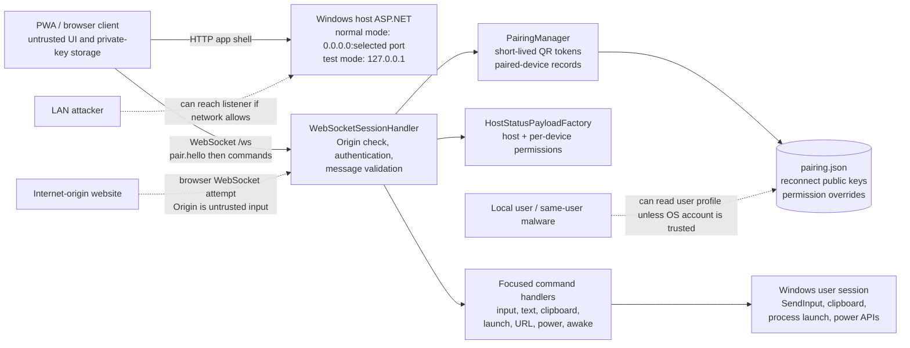
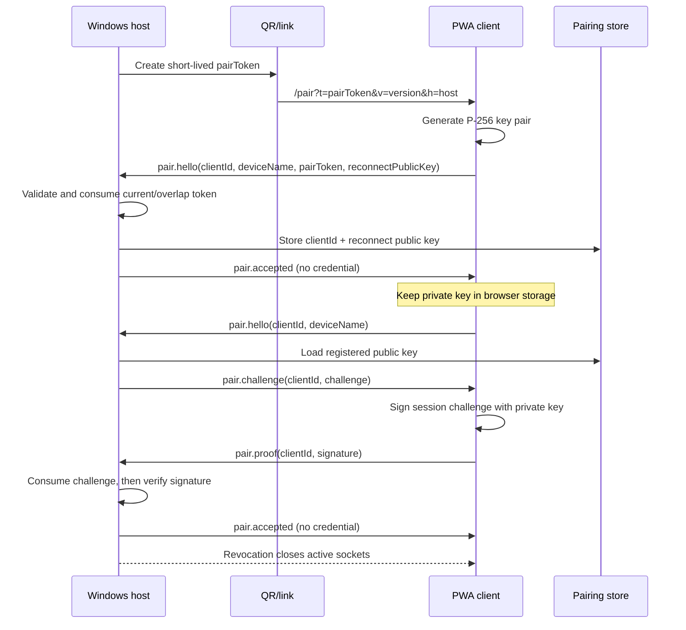
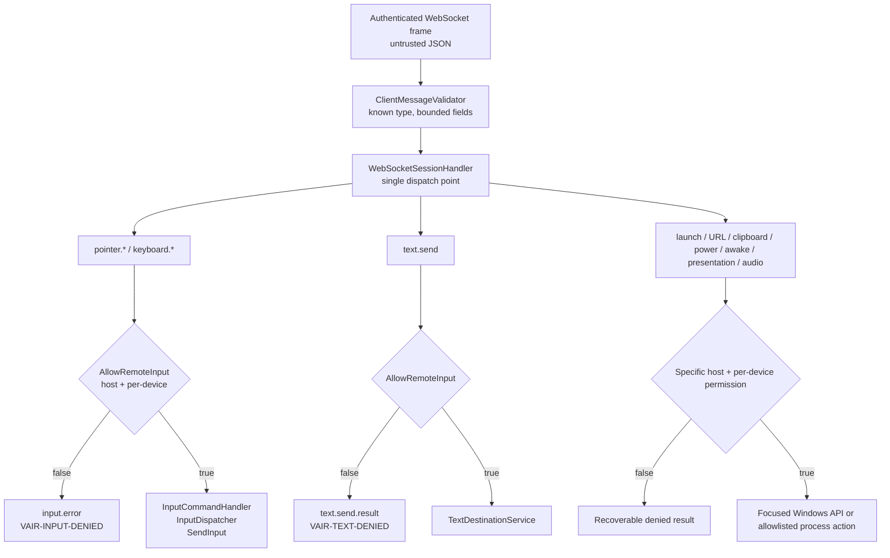
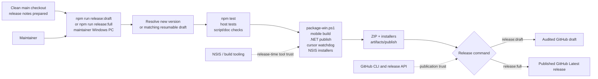

# Security architecture diagrams

Mermaid diagrams of security-sensitive flows. `docs/architecture.md` owns
subsystem boundaries; `docs/protocol.md` owns the wire contract.

## Runtime data flow

## Pairing and reconnect flow

## Authorization decision path

## Release and artifact-production flow

