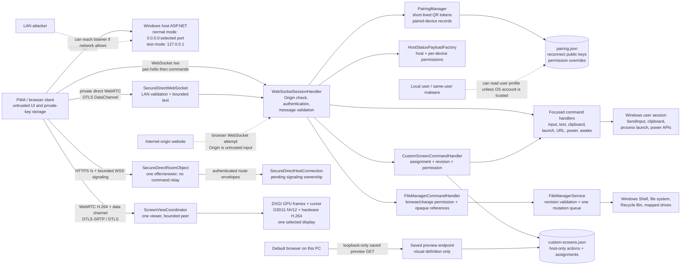
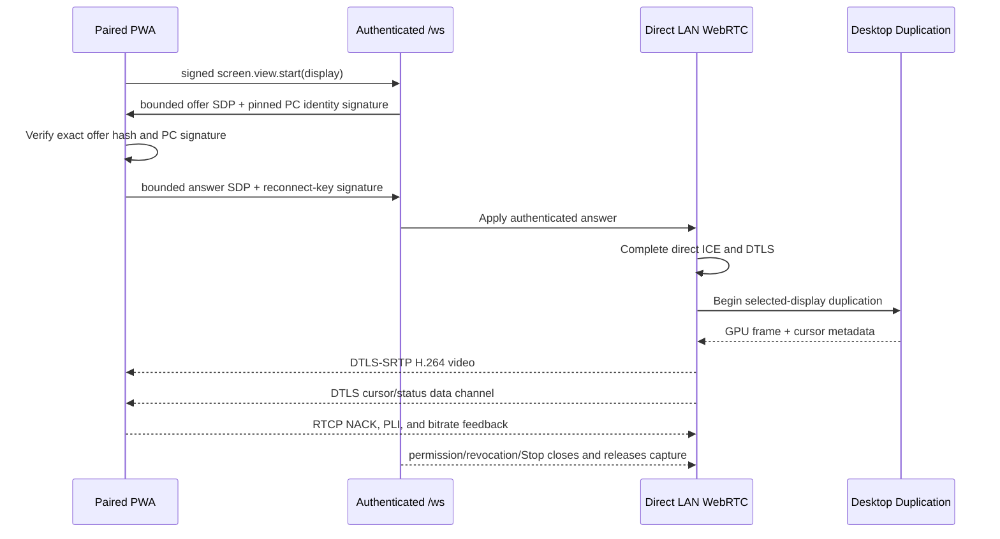
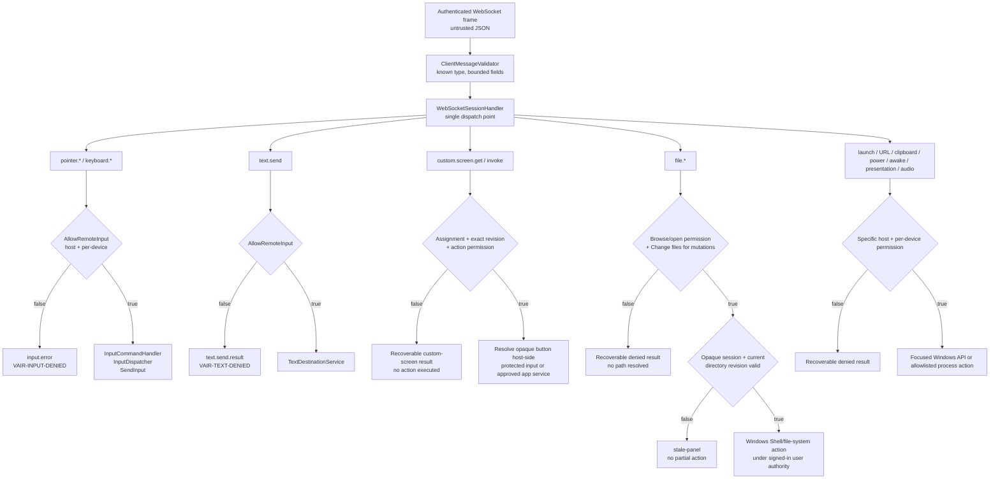
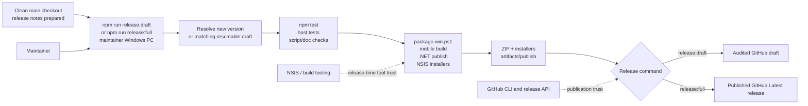

# Security architecture diagrams

Mermaid diagrams of security-sensitive flows. `docs/architecture.md` owns
subsystem boundaries; `docs/protocol.md` owns the wire contract.

## Runtime data flow

```mermaid
flowchart LR
  Client["PWA / browser client\nuntrusted UI and private-key storage"] -->|"HTTP app shell"| HostWeb["Windows host ASP.NET\nnormal mode: 0.0.0.0:selected port\ntest mode: 127.0.0.1"]
  Client -->|"WebSocket /ws\npair.hello then commands"| Session["WebSocketSessionHandler\nOrigin check, authentication,\nmessage validation"]
  Client -->|"HTTPS /s + bounded WSS signaling"| SecureRoom["SecureDirectRoomObject\none offer/answer; no command relay"]
  SecureRoom -->|"authenticated route envelopes"| SecureHost["SecureDirectHostConnection\npending signaling ownership"]
  Client -->|"private direct WebRTC\nDTLS DataChannel"| SecureSocket["SecureDirectWebSocket\nLAN validation + bounded text"]
  SecureSocket --> Session
  Client -->|"WebRTC H.264 + data channel\nDTLS-SRTP / DTLS"| ScreenStream["ScreenViewCoordinator\none viewer, bounded peer"]
  ScreenStream --> Capture["DXGI GPU frames + cursor\nD3D11 NV12 + hardware H.264\none selected display"]
  Session --> Pairing["PairingManager\nshort-lived QR tokens\npaired-device records"]
  Pairing --> Store[("pairing.json\nreconnect public keys\npermission overrides")]
  Session --> Policy["HostStatusPayloadFactory\nhost + per-device permissions"]
  Session --> Handlers["Focused command handlers\ninput, text, clipboard,\nlaunch, URL, power, awake"]
  Session --> CustomHandler["CustomScreenCommandHandler\nassignment + revision + permission"]
  Session --> FileHandler["FileManagerCommandHandler\nbrowse/change permission + opaque references"]
  FileHandler --> FileService["FileManagerService\nrevision validation + one mutation queue"]
  FileService --> FileSystem["Windows Shell, file system,\nRecycle Bin, mapped drives"]
  CustomHandler --> CustomStore[("custom-screens.json\nhost-only actions + assignments")]
  CustomHandler --> Handlers
  LocalBrowser["Default browser on this PC"] -->|"loopback-only saved preview GET"| Preview["Saved preview endpoint\nvisual definition only"]
  Preview --> CustomStore
  Handlers --> Windows["Windows user session\nSendInput, clipboard,\nprocess launch, power APIs"]

  Internet["Internet-origin website"] -. "browser WebSocket attempt\nOrigin is untrusted input" .-> Session
  Lan["LAN attacker"] -. "can reach listener if network allows" .-> HostWeb
  Local["Local user / same-user malware"] -. "can read user profile unless OS account is trusted" .-> Store
```

## Pairing and reconnect flow

```mermaid
sequenceDiagram
  participant Host as Windows host
  participant QR as QR/link
  participant Client as PWA client
  participant Store as Pairing store

  Host->>QR: Create one short-lived pairToken
  QR->>Client: /pair?t=pairToken&v=version&h=host
  Note over QR: No host identity or second identifier
  Client->>Client: Generate reconnect key + nonce; hash token ID
    Client->>Host: pair.hello(clientId, pairTokenId, clientNonce, reconnectPublicKey)
    Host->>Client: pair.bootstrap.challenge(serverNonce, host public identity, host HMAC proof)
  Client->>Client: Verify fingerprint + host proof using QR token
    Client->>Host: pair.bootstrap.proof(client HMAC proof)
  Host->>Host: Verify proof; consume current/overlap token
  Host->>Store: Store reconnect public key + pinned host fingerprint
  Host->>Client: pair.accepted(host public identity; no credential)
  Note over Client: Keep reconnect private key and pinned host public identity

  Client->>Host: pair.hello(clientId, deviceName)
  Host->>Store: Load registered public key
  Host->>Client: pair.challenge(clientId, challenge)
  Client->>Client: Sign session challenge with private key
  Client->>Host: pair.proof(clientId, signature)
  Host->>Host: Consume challenge, then verify signature
  Host->>Client: pair.accepted (no credential)

  Host-->>Client: Revocation closes active sockets
```

## Screen-stream authentication

```mermaid
sequenceDiagram
  participant Client as Paired PWA
  participant Control as Authenticated /ws
  participant Peer as Direct LAN WebRTC
  participant DXGI as Desktop Duplication

  Client->>Control: signed screen.view.start(display)
  Control->>Client: bounded offer SDP + pinned PC identity signature
  Client->>Client: Verify exact offer hash and PC signature
  Client->>Control: bounded answer SDP + reconnect-key signature
  Control->>Peer: Apply authenticated answer
  Peer->>Peer: Complete direct ICE and DTLS
  Peer->>DXGI: Begin selected-display duplication
  DXGI-->>Peer: GPU frame + cursor metadata
  Peer-->>Client: DTLS-SRTP H.264 video
  Peer-->>Client: DTLS cursor/status data channel
  Client-->>Peer: RTCP NACK, PLI, and bitrate feedback
  Control-->>Peer: permission/revocation/Stop closes and releases capture
```

## Authorization decision path

```mermaid
flowchart TD
  Frame["Authenticated WebSocket frame\nuntrusted JSON"] --> Validate["ClientMessageValidator\nknown type, bounded fields"]
  Validate --> Dispatch["WebSocketSessionHandler\nsingle dispatch point"]

  Dispatch --> Input["pointer.* / keyboard.*"]
  Input --> RemoteInput{"AllowRemoteInput\nhost + per-device"}
  RemoteInput -- "false" --> InputDenied["input.error\nVAIR-INPUT-DENIED"]
  RemoteInput -- "true" --> SendInput["InputCommandHandler\nInputDispatcher\nSendInput"]

  Dispatch --> Text["text.send"]
  Text --> TextPerm{"AllowRemoteInput"}
  TextPerm -- "false" --> TextDenied["text.send.result\nVAIR-TEXT-DENIED"]
  TextPerm -- "true" --> TextSink["TextDestinationService"]

  Dispatch --> Custom["custom.screen.get / invoke"]
  Custom --> CustomGate{"Assignment + exact revision\n+ action permission"}
  CustomGate -- "false" --> CustomDenied["Recoverable custom-screen result\nno action executed"]
  CustomGate -- "true" --> OpaqueAction["Resolve opaque button host-side\nprotected input or approved app service"]

  Dispatch --> Files["file.*"]
  Files --> FilePerm{"Browse/open permission\n+ Change files for mutations"}
  FilePerm -- "false" --> FileDenied["Recoverable denied result\nno path resolved"]
  FilePerm -- "true" --> FileRevision{"Opaque session + current\ndirectory revision valid"}
  FileRevision -- "false" --> FileStale["stale-panel\nno partial action"]
  FileRevision -- "true" --> FileAction["Windows Shell/file-system action\nunder signed-in user authority"]

  Dispatch --> Privileged["launch / URL / clipboard / power / awake / presentation / audio"]
  Privileged --> SpecificPerm{"Specific host + per-device permission"}
  SpecificPerm -- "false" --> RecoverableDeny["Recoverable denied result"]
  SpecificPerm -- "true" --> WindowsAction["Focused Windows API or allowlisted process action"]
```

## Release and artifact-production flow

```mermaid
flowchart LR
  Source["Clean main checkout\nrelease notes prepared"] --> Local["npm run release:draft\nor npm run release:full\nmaintainer Windows PC"]
  Local --> Guard["Resolve new version\nor matching resumable draft"]
  Guard --> Test["npm test\nhost tests\nscript/doc checks"]
  Test --> Package["package-win.ps1\nmobile build\n.NET publish\nNSIS installers"]
  Package --> Artifacts["ZIP + installers\nartifacts/publish"]
  Artifacts --> Mode{"Release command"}
  Mode -->|"release:draft"| Draft["Audited GitHub draft"]
  Mode -->|"release:full"| Public["Published GitHub Latest release"]

  GitHub["GitHub CLI and release API"] -. "publication trust" .-> Mode
  Tooling["NSIS / build tooling"] -. "release-time tool trust" .-> Package
  Maintainer["Maintainer"] --> Local
```
